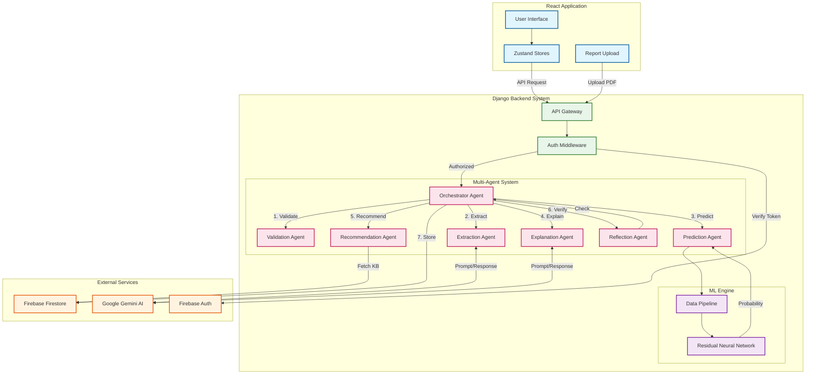

# Health Intelligence System Architecture

## 1. Executive Summary
The Health Intelligence System is an advanced AI-powered platform designed to provide preliminary health assessments, disease prediction, and detailed medical explanations. It leverages a modern technology stack with a **Service-Oriented Architecture (SOA)**, integrating a **Django-based backend**, a **React frontend**, and **Google Gemini AI** for natural language understanding and explanation generation.

The core innovation lies in its **Multi-Agent Orchestration** system, which coordinates specialized tasks (validation, extraction, prediction, explanation) to deliver accurate and interpretable results. The system is built for scalability, security, and ease of use.

---

## 2. System Architecture Overview

The system follows a three-tier architecture pattern:

### 2.1. High-Level Architecture Diagram

### 2.2. Architectural Layers

#### Presentation Layer (Frontend)
*   **Technology**: React 18, TypeScript, Vite, Material UI.
*   **Role**: Handles user interaction, specific symptom input, report uploading, and visualization of results.
*   **Key Components**:
    *   **Assessment Stepper**: Dynamic form for collecting symptoms and vitals.
    *   **Dashboard**: Overview of health history and system status.
    *   **State Management**: Zustand for efficient local state handling.

### 2.2. Application Layer (Backend)
*   **Technology**: Django 4.2, Django REST Framework, Python 3.8+.
*   **Role**: Orchestrates the business logic, manages authentication, and coordinates AI agents.
*   **Key Components**:
    *   **Orchestrator Agent**: The central brain that manages the assessment pipeline.
    *   **API Layer**: RESTful endpoints for frontend communication.
    *   **Firebase Admin SDK**: Handles secure token verification.

### 2.3. Data & AI Layer
*   **Database**: Firebase Firestore (NoSQL) for storing user profiles, assessments, and medical history.
*   **Machine Learning**: PyTorch-based Deep Neural Network for disease prediction.
*   **Generative AI**: Google Gemini Pro for parsing medical reports and generating natural language explanations.

---

## 3. Backend Algorithm: Multi-Agent Orchestration

The backend uses a **Linear Orchestration Algorithm** where a master `OrchestratorAgent` coordinates specialized sub-agents. The process flow is as follows:

1.  **Input Validation**: `ValidationAgent` ensures user input (symptoms, age, gender) is complete and coherent.
2.  **Data Extraction**: If a medical report is uploaded, `DataExtractionAgent` uses Gemini AI to parse unstructured text into structured data (vitals, blood tests).
3.  **Data Merging**: Manually entered symptoms are intelligently merged with extracted report data, prioritizing recent manual inputs.
4.  **Disease Prediction**: The aggregated symptom vector is passed to the `PredictionAgent` (see Section 4).
5.  **Confidence Evaluation**: The system calculates a confidence score based on prediction probability and data completeness.
6.  **Explanation Generation**: `ExplanationAgent` prompts Gemini AI to explain *why* a prediction was made, citing specific matching symptoms.
7.  **Recommendation Engine**: `RecommendationAgent` queries a medical knowledge base to suggest next steps (e.g., "Consult a Cardiologist", "Dietary changes").
8.  **Cross-Verification**: `ReflectionAgent` performs a final sanity check on the entire assessment before returning it to the user.

---

## 4. ML Prediction Algorithm: Residual Neural Networks

The core disease prediction engine utilizes a specialized **Deep Neural Network with Residual Connections (ResNet-style)** architecture. This approach addresses the vanishing gradient problem in deep networks, allowing the model to learn complex, non-linear relationships between symptoms and diseases.

### 4.1. Model Architecture
*   **Input Layer**: Accepts a **Multi-Hot Encoded Vector** representing the presence or absence of hundreds of potential symptoms.
*   **Deep Feature Extraction**:
    *   The network consists of multiple stacked **Residual Blocks**.
    *   Each block contains: `Linear -> BatchNorm -> ReLU -> Dropout`.
    *   **Skip Connections**: The input of each block is added to its output (`x + F(x)`), allowing gradients to flow through the network more effectively during training.
*   **Dropout Regularization**: Applied (rate=0.3) to prevent overfitting and improve generalization.
*   **Output Layer**: A final Linear layer with Softmax activation maps features to disease probabilities.

### 4.2. Inference Process
1.  **Normalization**: Input symptom text is cleaned and normalized.
2.  **Vectorization**: Symptoms are matched against a controlled vocabulary and converted into a multi-hot vector.
3.  **Forward Pass**: The vector flows through the Residual Network to produce raw logits.
4.  **Probability Calibration**: Softmax converts logits into probabilities. The highest probability class is selected as the predicted disease.

---

## 5. Security & Data Flow

Data security is paramount in health applications. The system implements:
*   **Authentication**: Firebase Auth (Google OAuth/Email) issues JWT tokens.
*   **Authorization**: Backend validates tokens on every API request.
*   **Privacy**: Users can only access their own records via Firestore Security Rules.
*   **Encrypted Transport**: All data in transit is encrypted via HTTPS (TLS).

**Data Flow Summary**:
`User Input -> React -> API (Secured) -> Orchestrator -> Neural Network / Gemini -> Firestore -> Result Display`
